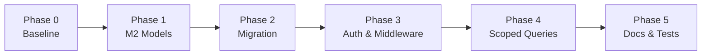
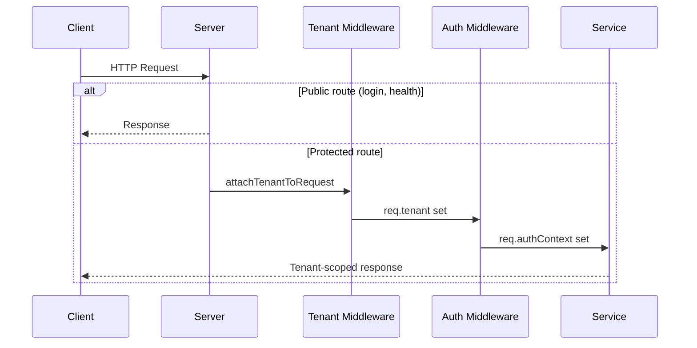

# Milestone 3 — Client Submission Document

**Project:** MiraCore ESS Multi-Tenancy  
**Milestone:** 3 — Tenant Isolation Middleware & API Key Authentication  
**Component:** Ess-Backend (with Ess-Frontend backward-compatibility verified)  
**Date:** June 2026

---

## 1. Executive Summary

Milestone 3 delivers the **core multi-tenant security layer** for the MiraCore backend. Every protected request now resolves a **tenant context** (`req.tenant`) and an **authentication context** (`req.authContext`). Tenant-owned data is isolated using `tenantId` on all relevant collections and query helpers.

This milestone includes **Milestone 2 prerequisites** (tenant models and database migration) because they are required for M3 to function.

**Ess-Frontend:** No new UI was added. The existing login screen continues to work unchanged. New fields in the login API response are available for future milestones (M5).

---

## 2. Scope Delivered vs Deferred

### In Scope (Delivered)

| Area | Deliverable |
|------|-------------|
| Tenant models | `Tenant`, `TenantUser`, `ApiKey` Mongoose models |
| Data migration | `scripts/migrate-to-multitenancy.js` executed on Atlas `ess` DB |
| Schema updates | `tenantId` added to `LoanMapping`, `MessageLog`, `AuditLog`, `Product`, `Notification` |
| Middleware | `tenantMiddleware.js`, `tenantValidator.js` |
| Query isolation | `tenantQuery.js` secure query helpers |
| Authentication | JWT tenant context, API key login, tenant selection |
| Service refactors | Loan, message, product, and compat routes tenant-scoped |
| Tests | 33 automated tests (models, middleware, isolation) |
| Documentation | Technical docs + this client submission |

### Out of Scope (Deferred to M4 / M5)

| Item | Target Milestone |
|------|------------------|
| Tenant onboarding / CRUD REST APIs | M4 |
| API key management UI and REST endpoints | M4 |
| Onboarding wizard and admin portal UI | M5 |
| Per-tenant MIFOS client configuration | M4 / M5 |
| Full frontend RBAC and tenant switcher UI | M5 |

---

## 3. Implementation Plan Executed

The work was completed in six phases:



| Phase | Description | Status |
|-------|-------------|--------|
| **0 — Baseline** | Environment validation, multi-tenancy env vars | Done |
| **1 — M2 Models** | Port `Tenant`, `TenantUser`, `ApiKey`; crypto utilities; model tests | Done |
| **2 — Migration** | Add `tenantId` to existing models; run migration on Atlas | Done |
| **3 — Auth & Middleware** | Tenant resolution, API key auth, JWT extensions, rate limiting | Done |
| **4 — Scoped Queries** | `tenantQuery` helper; refactor services/controllers | Done |
| **5 — Docs & Tests** | Middleware docs, migration guide, isolation tests, `.env.example` | Done |

---

## 4. New API Endpoints

### 4.1 `POST /api/v1/auth/login-with-api-key`

Authenticates an FSP system using a tenant API key (system-to-system access).

**Authentication:** Public (credentials in request)

**Headers (preferred):**

| Header | Required | Description |
|--------|----------|-------------|
| `X-Tenant-Key` | Yes | API key (`mk_live_...` or `mk_test_...`) |
| `X-Tenant-Secret` | No | API secret (validated when provided) |

**Body (alternative):**

```json
{
  "apiKey": "mk_live_...",
  "apiSecret": "optional-secret"
}
```

**Success response (200):**

```json
{
  "success": true,
  "message": "API key authentication successful.",
  "data": {
    "token": "<jwt>",
    "tenant": {
      "tenantId": "legacy-zedone",
      "fspCode": "FL8090",
      "fspName": "ZE DONE",
      "status": "active",
      "authMethod": "api_key"
    },
    "permissions": [],
    "apiKey": { "name": "...", "keyPrefix": "mk_live_..." }
  }
}
```

**Error responses:** `400` (missing key), `401` (invalid key/secret), `403` (inactive tenant), `429` (rate limited)

---

### 4.2 `POST /api/v1/auth/select-tenant`

Allows a user with multiple tenant memberships (or a super admin) to switch active tenant and receive a new JWT.

**Authentication:** Bearer JWT required

**Body:**

```json
{
  "tenantId": "legacy-zedone"
}
```

**Success response (200):**

```json
{
  "success": true,
  "message": "Tenant selected.",
  "data": {
    "token": "<new-jwt-with-tenantId>",
    "activeTenant": { "tenantId": "...", "fspCode": "...", "status": "active" },
    "permissions": ["tenant:read", "users:manage"]
  }
}
```

**Error responses:** `400`, `403` (no membership), `404` (tenant not found)

---

## 5. Updated API Endpoints

These existing endpoints remain at the **same URLs** and accept the **same request formats**. Responses are **backward-compatible** — all previous fields are still present; new fields are **added** alongside them.

### 5.1 `POST /api/v1/auth/login` (Updated)

**Request:** Unchanged

```json
{
  "username": "admin",
  "password": "Admin@123"
}
```

#### Response — Before (pre–Milestone 3)

```json
{
  "success": true,
  "message": "Login successful.",
  "data": {
    "token": "<jwt>",
    "user": {
      "id": "665abc123...",
      "username": "admin",
      "email": "admin@example.com",
      "role": "super_admin",
      "fullName": "System Administrator",
      "lastLogin": "2026-06-01T10:00:00.000Z"
    }
  }
}
```

**JWT payload (decoded) — Before:**

```json
{
  "userId": "665abc123...",
  "username": "admin",
  "email": "admin@example.com",
  "role": "super_admin",
  "iat": 1710000000,
  "exp": 1710604800,
  "iss": "emkopo-backend",
  "sub": "665abc123..."
}
```

#### Response — After (Milestone 3)

```json
{
  "success": true,
  "message": "Login successful.",
  "data": {
    "token": "<jwt>",
    "user": {
      "id": "665abc123...",
      "username": "admin",
      "email": "admin@example.com",
      "role": "super_admin",
      "fullName": "System Administrator",
      "lastLogin": "2026-06-15T10:00:00.000Z"
    },
    "activeTenant": {
      "tenantId": "legacy-zedone",
      "tenantObjectId": "6a2f8ea810cb3deb64a0b5ff",
      "fspCode": "FL8090",
      "fspName": "ZE DONE",
      "status": "active",
      "subscriptionPlan": "standard",
      "authMethod": "jwt"
    },
    "memberships": [
      {
        "tenantId": "legacy-zedone",
        "tenantName": "Legacy ZE DONE Tenant",
        "fspCode": "FL8090",
        "role": "tenant_admin",
        "permissions": ["tenant:read", "tenant:update", "users:manage", "api_keys:manage", "dashboard:read", "audit:read"],
        "isActive": true
      }
    ],
    "permissions": ["tenant:read", "tenant:update", "users:manage", "api_keys:manage", "dashboard:read", "audit:read"]
  }
}
```

**JWT payload (decoded) — After:**

```json
{
  "userId": "665abc123...",
  "username": "admin",
  "email": "admin@example.com",
  "role": "super_admin",
  "tenantId": "legacy-zedone",
  "tenantRole": "tenant_admin",
  "permissions": ["tenant:read", "tenant:update", "users:manage", "..."],
  "isSuperAdmin": true,
  "iat": 1710000000,
  "exp": 1710604800,
  "iss": "emkopo-backend",
  "sub": "665abc123..."
}
```

#### What changed (login)

| Area | Before | After |
|------|--------|-------|
| `data.token` | Present | Present (unchanged field) |
| `data.user` | Present | Present (unchanged shape) |
| `data.activeTenant` | Not present | **Added** — currently selected tenant |
| `data.memberships` | Not present | **Added** — all tenants the user belongs to |
| `data.permissions` | Not present | **Added** — permissions for active tenant |
| JWT `tenantId` | Not in token | **Added** |
| JWT `tenantRole` | Not in token | **Added** |
| JWT `permissions` | Not in token | **Added** |
| JWT `isSuperAdmin` | Not in token | **Added** |

**Ess-Frontend compatibility:** `Login.jsx` reads `data.token` and `data.user` only — **no frontend changes required**. New fields can be ignored until Milestone 5.

---

### 5.2 `GET /api/v1/auth/profile` (Updated)

**Request:** Unchanged — `Authorization: Bearer <token>`

#### Response — Before (pre–Milestone 3)

```json
{
  "success": true,
  "data": {
    "user": {
      "_id": "665abc123...",
      "username": "admin",
      "email": "admin@example.com",
      "role": "super_admin",
      "fullName": "System Administrator",
      "phone": null,
      "isActive": true,
      "lastLogin": "2026-06-01T10:00:00.000Z",
      "createdAt": "2025-01-01T00:00:00.000Z",
      "updatedAt": "2026-06-01T10:00:00.000Z"
    }
  }
}
```

#### Response — After (Milestone 3)

```json
{
  "success": true,
  "data": {
    "user": {
      "_id": "665abc123...",
      "username": "admin",
      "email": "admin@example.com",
      "role": "super_admin",
      "fullName": "System Administrator",
      "phone": null,
      "isActive": true,
      "lastLogin": "2026-06-15T10:00:00.000Z",
      "createdAt": "2025-01-01T00:00:00.000Z",
      "updatedAt": "2026-06-15T10:00:00.000Z"
    },
    "tenants": [
      {
        "tenantId": "legacy-zedone",
        "tenantName": "Legacy ZE DONE Tenant",
        "fspCode": "FL8090",
        "role": "tenant_admin",
        "permissions": ["tenant:read", "users:manage", "..."],
        "isActive": true
      }
    ],
    "activeTenant": {
      "tenantId": "legacy-zedone",
      "tenantObjectId": "6a2f8ea810cb3deb64a0b5ff",
      "fspCode": "FL8090",
      "fspName": "ZE DONE",
      "status": "active",
      "subscriptionPlan": "standard",
      "authMethod": "jwt"
    },
    "authContext": {
      "principalType": "user",
      "userId": "665abc123...",
      "apiKeyId": null,
      "role": "tenant_admin",
      "permissions": ["tenant:read", "users:manage", "..."],
      "isSuperAdmin": true
    }
  }
}
```

#### What changed (profile)

| Area | Before | After |
|------|--------|-------|
| `data.user` | Present | Present (unchanged) |
| `data.tenants` | Not present | **Added** — tenant memberships list |
| `data.activeTenant` | Not present | **Added** — tenant from request context |
| `data.authContext` | Not present | **Added** — who is acting (user vs API key) |

---

### 5.3 Other auth endpoints (unchanged response shape)

These endpoints were **not** changed in response structure. Only internal audit logs may now include `tenantId`.

| Endpoint | Response change |
|----------|-----------------|
| `POST /api/v1/auth/logout` | No change |
| `POST /api/v1/auth/change-password` | No change |

**Example — logout (unchanged):**

```json
{
  "success": true,
  "message": "Logout successful."
}
```

---

### 5.4 Protected data APIs (Behavior Updated — Same URLs)

All routes below now resolve tenant context via middleware. When `TENANT_ENFORCEMENT=false` (default in development), the **legacy tenant** (`legacy-zedone`) is auto-attached so existing integrations keep working.

| Route group | Example endpoints | How updated |
|-------------|-------------------|-------------|
| **Products** | `GET /api/v1/products`, `GET /api/v1/loan/list-products` | Queries filtered by `req.tenant.tenantId` |
| **Loans (admin compat)** | `GET /api/v1/loan/list-employee-loan` | `LoanMappingService.getAllWithDetails()` scoped by tenant |
| **Loans (frontend)** | `GET /api/frontend/loan/records` | `LoanMapping.find()` filtered by tenant |
| **Messages** | Message log endpoints in `messageController` | `MessageLog` queries include `tenantId` |
| **Audit** | Audit log writes via `auditMiddleware` | Records include `tenantId`, `actorType`, `apiKeyId` when applicable |
| **XML / ESS API** | `POST /api/...` (loan offer, takeover, etc.) | FSP code in XML validated against `req.tenant.fspCode`; legacy tenant auto-attached |

**JWT-protected routes:** Send `Authorization: Bearer <token>` as before. Token may now embed `tenantId`.

**API-key-protected routes:** Send `X-Tenant-Key: mk_live_...` header; tenant resolved before handler execution.

#### Data API response bodies

**Response JSON shape for product/loan/message list endpoints is unchanged.** The difference is **server-side filtering** — results now only include records where `tenantId` matches the authenticated tenant. Clients see the same field names; the dataset is scoped per tenant.

| Area | Before | After |
|------|--------|-------|
| Response JSON structure | Same fields (`products`, `loans`, `messages`, etc.) | Same fields |
| Records returned | All records in database | Only records for authenticated tenant |
| Request headers | `Authorization: Bearer <token>` | Same (+ optional `X-Tenant-Key` for system clients) |
| Error if no tenant | N/A | `403` when `TENANT_ENFORCEMENT=true` and tenant cannot be resolved |

---

## 6. New Backend Components

### 6.1 Models (Milestone 2 prerequisite)

| File | Purpose |
|------|---------|
| `src/models/Tenant.js` | FSP tenant record (FSP code, MIFOS config, subscription, status) |
| `src/models/TenantUser.js` | User ↔ tenant membership and role |
| `src/models/ApiKey.js` | Hashed API keys per tenant (`mk_live_` / `mk_test_`) |

### 6.2 Middleware & Utilities

| File | Purpose |
|------|---------|
| `src/middleware/tenantMiddleware.js` | Resolves `req.tenant` from JWT, API key, or legacy fallback |
| `src/middleware/tenantValidator.js` | Active-tenant check, per-tenant rate limits, API access audit |
| `src/utils/tenantQuery.js` | `buildTenantQuery`, `secureFindOne`, `secureCreate`, etc. |
| `src/utils/tenantSecretCrypto.js` | AES-256-GCM encryption, bcrypt hashing for API keys |
| `src/utils/apiKeyGenerator.js` | `mk_live_` / `mk_test_` key generation |

### 6.3 Updated Core Files

| File | Change |
|------|--------|
| `src/utils/jwtUtils.js` | Tenant fields in JWT payload |
| `src/controllers/authController.js` | Extended login/profile; new API key and select-tenant handlers |
| `src/middleware/authMiddleware.js` | Sets `req.authContext` |
| `src/middleware/signatureMiddleware.js` | Rejects XML when `FSPCode` ≠ tenant `fspCode` |
| `src/middleware/metricsMiddleware.js` | `tenant_requests_total` metric by tenant |
| `server.js` | Tenant middleware mounted before protected routes |
| `src/config/validateEnv.js` | New env var validation and defaults |

### 6.4 Schema Updates (existing models)

`tenantId` and `tenant` (ObjectId ref) added to:

- `LoanMapping`, `MessageLog`, `AuditLog`, `Product`, `Notification`

Compound indexes updated to be **tenant-scoped** (e.g. `{ tenantId, productCode }` unique instead of global `productCode` unique).

---

## 7. Database Migration

**Script:** `Ess-Backend/scripts/migrate-to-multitenancy.js`

**Executed on:** MongoDB Atlas — `ess` database

**Results:**

| Action | Count |
|--------|-------|
| Legacy tenant `legacy-zedone` created | 1 |
| `TenantUser` memberships created | 1 |
| `AuditLog` records backfilled with `tenantId` | 5 |
| Other collections | Already compliant / 0 records to backfill |

**Commands for operations team:**

```bash
# Dry run (no writes)
node scripts/migrate-to-multitenancy.js --dry-run

# Execute
node scripts/migrate-to-multitenancy.js

# Validate
node scripts/migrate-to-multitenancy.js --validate-only

# Rollback (if needed)
node scripts/migrate-to-multitenancy.js --rollback
```

Full guide: `docs/MIGRATION_GUIDE_MULTI_TENANCY.md`

---

## 8. Environment Configuration

Add to `.env` (see `.env.example`):

```env
TENANT_SECRET_ENCRYPTION_KEY=<64-char-hex>   # Required for API key / secret encryption
LEGACY_TENANT_ID=legacy-zedone               # Default tenant for migrated data
TENANT_ENFORCEMENT=false                     # Set true in production after validation
```

Generate encryption key:

```bash
node -e "console.log(require('crypto').randomBytes(32).toString('hex'))"
```

---

## 9. Request Flow (After M3)



**Public routes (no tenant required):**

- `GET /health`
- `POST /api/v1/auth/login`
- `POST /api/v1/auth/login-with-api-key`
- `GET /api-docs`

---

## 10. Security Features

| Feature | Description |
|---------|-------------|
| Tenant isolation | All tenant-owned queries include `tenantId` |
| API key hashing | Raw keys never stored; bcrypt hash only |
| Secret encryption | MIFOS passwords and API secrets encrypted at rest (AES-256-GCM) |
| FSP code validation | XML `FSPCode` must match authenticated tenant |
| Rate limiting | Per-tenant limits (default 60/min, 1000/hour) |
| Audit logging | API access and auth events logged with `tenantId` |
| Feature flag | `TENANT_ENFORCEMENT=false` allows legacy auto-attach during rollout |

---

## 11. Testing

| Test suite | Location | Tests |
|------------|----------|-------|
| Tenant model | `src/models/__tests__/Tenant.test.js` | 3 |
| TenantUser model | `src/models/__tests__/TenantUser.test.js` | 2 |
| ApiKey model | `src/models/__tests__/ApiKey.test.js` | 3 |
| Tenant middleware | `src/middleware/__tests__/tenantMiddleware.test.js` | 20+ |
| Tenant isolation | `tests/integration/tenantIsolation.test.js` | 5 |
| **Total** | | **33 passing** |

Run M3 tests:

```bash
cd Ess-Backend
npx jest --runInBand --forceExit \
  src/models/__tests__ \
  src/middleware/__tests__/tenantMiddleware.test.js \
  tests/integration/tenantIsolation.test.js
```

---

## 12. Documentation Delivered

| Document | Audience | Path |
|----------|----------|------|
| **This document** | Client / stakeholders | `docs/MILESTONE_3_CLIENT_SUBMISSION.md` |
| Middleware reference | Developers | `docs/MIDDLEWARE_DOCUMENTATION.md` |
| Migration guide | DevOps / DB admin | `docs/MIGRATION_GUIDE_MULTI_TENANCY.md` |
| Model reference | Developers | `docs/MODEL_DOCUMENTATION.md` |
| Environment template | DevOps | `.env.example` |

---

## 13. Known Limitations (M3)

1. **MIFOS/CBS** still uses global `CBS_Tenant` from `.env` — per-tenant MIFOS clients deferred to M4/M5.
2. **API key management UI** not included — keys created programmatically or via future M4 APIs.
3. **Some XML handlers** rely on legacy tenant auto-attach; full `tenantId` threading through every handler is incremental.
4. **`auditController` and `loanActions` routes** — audit reads not yet tenant-filtered in UI layer; writes include tenant via middleware.

---

## 14. Milestone 3 Acceptance Checklist

| Criterion | Status |
|-----------|--------|
| Middleware intercepts protected requests | Yes |
| `tenantId` attached to `req.tenant` | Yes |
| Tenant-owned queries filter by tenant | Yes (core services) |
| API key validation works | Yes |
| Per-tenant rate limiting | Yes |
| No cross-tenant data leakage (tests) | Yes |
| Tests pass | Yes (33 tests) |
| `MIDDLEWARE_DOCUMENTATION.md` delivered | Yes |
| Existing frontend login works | Yes (backward-compatible) |

---

## 15. Next Steps (Milestone 4 / 5)

- **M4:** Tenant CRUD APIs, API key management endpoints, onboarding API phase 1
- **M5:** Onboarding wizard, admin portal, tenant switcher in Ess-Frontend, per-tenant MIFOS configuration

---

*For technical support or walkthrough, refer to `docs/MIDDLEWARE_DOCUMENTATION.md` or contact the development team.*
