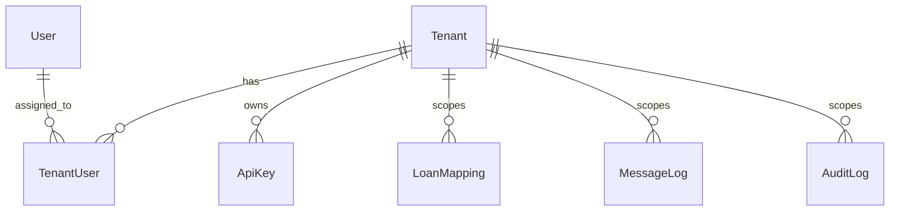

# Model Documentation — Multi-Tenancy Data Models

| | |
| --- | --- |
| **Version** | 1.0 |
| **Milestone** | 2 — Tenant Data Models & Database Schema |
| **Status** | Implementation-ready |

**Related:** [MILESTONE_2_DELIVERABLES.md](MILESTONE_2_DELIVERABLES.md) · [database-indexes-and-optimization.md](database-indexes-and-optimization.md) · [../data-models.md](../data-models.md)

---

## Overview

MiraCore multi-tenancy uses **shared MongoDB collections** with explicit `tenantId` on tenant-owned records. Three new models form the foundation:

| Model | Collection | Purpose |
| --- | --- | --- |
| `Tenant` | `tenants` | FSP organization root — config, credentials, lifecycle |
| `TenantUser` | `tenantusers` | Links platform `User` accounts to tenants with roles |
| `ApiKey` | `apikeys` | System-to-system authentication per tenant |



---

## Tenant

**File:** `schemas/Tenant.js` → deploy to `src/models/Tenant.js`

Represents one Financial Service Provider (FSP) using the platform.

### Field Reference

| Field | Type | Required | Unique | Notes |
| --- | --- | --- | --- | --- |
| tenantId | String | Yes | Yes | Lowercase, immutable, URL-safe |
| tenantName | String | Yes | No | Organization display name |
| fspCode | String | Yes | Yes | Uppercase, matches ESS FSPCode |
| fspName | String | Yes | No | Official FSP name |
| contactPerson | String | Yes | No | Primary contact |
| contactEmail | String | Yes | No | Validated email |
| contactPhone | String | Yes | No | |
| status | Enum | Yes | No | Lifecycle state (see below) |
| mifosConfig | Object | Conditional | No | Required before activation |
| apiCredentials | Object | No | No | Default rate limits, signature rules |
| certificates | Object | No | No | File paths only — not raw keys |
| subscription | Object | No | No | Plan and usage limits |
| metadata | Object | No | No | Logo, theme, support info |
| createdAt | Date | Auto | No | Mongoose timestamps |
| updatedAt | Date | Auto | No | Mongoose timestamps |

### Status Lifecycle

| Status | Meaning |
| --- | --- |
| `draft` | Onboarding started, not submitted |
| `submitted` | Submitted for platform review |
| `under_review` | Platform admin reviewing |
| `approved` | Approved but not yet active |
| `active` | Can authenticate and process requests |
| `rejected` | Onboarding rejected |
| `suspended` | Temporarily blocked |
| `disabled` | Permanently disabled |

Only `active` tenants may process loan operations.

### MIFOS Configuration

```js
mifosConfig: {
  mode: 'inherit_default' | 'override',
  baseUrl: String,
  tenantId: String,           // Fineract tenant identifier
  makerUsername: String,
  makerPasswordEncrypted: String,  // AES-256-GCM encrypted
  checkerUsername: String,
  checkerPasswordEncrypted: String,
  callbackUrl: String,
  timeoutMs: Number,
  isConfigured: Boolean,
  lastValidatedAt: Date
}
```

Passwords are encrypted on save via `tenantSecretCrypto.encryptSecret()`. Use `tenant.getMakerPassword()` / `getCheckerPassword()` at runtime — never expose in API responses.

### Instance Methods

| Method | Returns | Description |
| --- | --- | --- |
| `getMakerPassword()` | String | Decrypted MIFOS maker password |
| `getCheckerPassword()` | String | Decrypted MIFOS checker password |
| `isOperational()` | Boolean | `true` when status is `active` |
| `toSafeJSON()` | Object | JSON with secrets redacted |

---

## TenantUser

**File:** `schemas/TenantUser.js` → deploy to `src/models/TenantUser.js`

Links platform users to tenants with tenant-scoped roles.

### Field Reference

| Field | Type | Required | Unique | Notes |
| --- | --- | --- | --- | --- |
| tenantId | String | Yes | Compound | With userId |
| tenant | ObjectId | Yes | No | Ref `Tenant` |
| userId | ObjectId | Yes | Compound | Ref `User` |
| role | Enum | Yes | No | See roles below |
| permissions | [String] | No | No | Additional permissions beyond role |
| isActive | Boolean | Yes | No | Default `true` |
| invitedBy | ObjectId | No | No | Ref `User` |
| invitedAt | Date | No | No | |
| activatedAt | Date | No | No | |
| deactivatedAt | Date | No | No | |

### Roles and Default Permissions

| Role | Default Permissions |
| --- | --- |
| `tenant_admin` | tenant:read, tenant:update, users:manage, api_keys:manage, dashboard:read, audit:read |
| `operations_manager` | loans:read, loans:operate, messages:read, messages:operate, dashboard:read |
| `finance_officer` | loans:read, repayments:read, dashboard:read, reports:read |
| `support_staff` | loans:read, messages:read, notifications:read |

Custom permissions in the `permissions` array are merged with role defaults via `getEffectivePermissions()`.

### Static Methods

| Method | Description |
| --- | --- |
| `findActiveMembership(userId, tenantId)` | Active membership for a user in a tenant |
| `findActiveTenantsForUser(userId)` | All active tenant memberships for login/tenant selection |

---

## ApiKey

**File:** `schemas/ApiKey.js` → deploy to `src/models/ApiKey.js`

Supports tenant system-to-system API authentication.

### Field Reference

| Field | Type | Required | Unique | Notes |
| --- | --- | --- | --- | --- |
| tenantId | String | Yes | No | |
| tenant | ObjectId | Yes | No | Ref `Tenant` |
| name | String | Yes | No | Friendly label |
| keyPrefix | String | Yes | No | Display prefix, e.g. `mk_live_abc` |
| keyHash | String | Yes | Yes | bcrypt hash — raw key never stored |
| secretEncrypted | String | No | No | AES-256-GCM encrypted secret |
| permissions | [String] | No | No | Scoped API access |
| status | Enum | Yes | No | active, revoked, expired, disabled |
| isActive | Boolean | Yes | No | Synced from status |
| expiresAt | Date | No | No | Optional expiry |
| lastUsedAt | Date | No | No | Updated on each use |
| lastUsedIp | String | No | No | |
| usageCount | Number | No | No | Default 0 |
| rateLimit | Object | No | No | requestsPerMinute, requestsPerHour |
| ipWhitelist | [String] | No | No | Optional IP restriction |

### Security Rules

1. **Generation:** Use `ApiKey.createForTenant()` — returns raw key/secret once.
2. **Storage:** Only `keyHash` (bcrypt) and `secretEncrypted` (AES-256-GCM) are persisted.
3. **Display:** API responses use `toSafeJSON()` — keys are masked.
4. **Rotation:** Create new key, migrate consumers, revoke old key.
5. **Lookup:** `findByRawKey(rawKey)` compares bcrypt hashes against active keys.

### Instance Methods

| Method | Description |
| --- | --- |
| `verifyKey(rawKey)` | bcrypt compare against stored hash |
| `isUsable()` | Checks active status and expiry |
| `recordUsage(ip)` | Updates lastUsedAt, usageCount |
| `revoke(revokedBy, reason)` | Sets status to revoked |

---

## Secret Handling

**Utility:** `schemas/tenantSecretCrypto.js` → deploy to `src/utils/tenantSecretCrypto.js`

| Secret type | Storage method | Reversible |
| --- | --- | --- |
| MIFOS passwords | AES-256-GCM (`encryptSecret`) | Yes — for runtime CBS calls |
| API key | bcrypt hash (`hashValue`) | No — verify only |
| API secret | AES-256-GCM (`encryptSecret`) | Yes — for secret-based auth |

**Environment variable:**

```env
TENANT_SECRET_ENCRYPTION_KEY=<64-char-hex-or-32-byte-base64>
```

Generate a key:

```bash
node -e "console.log(require('crypto').randomBytes(32).toString('hex'))"
```

---

## Relationships

```
User (platform identity)
  └── TenantUser (membership + role)
        └── Tenant (FSP config)
              ├── ApiKey (system access)
              ├── LoanMapping (scoped data)
              ├── MessageLog (scoped data)
              ├── AuditLog (scoped events)
              ├── Product (scoped catalog)
              └── Notification (scoped alerts)
```

- One `User` may belong to multiple tenants via separate `TenantUser` records.
- One `Tenant` has many `ApiKey` records; each key belongs to exactly one tenant.
- All tenant-owned data references both `tenantId` (string, for queries) and `tenant` (ObjectId, for population).

---

## Validation Summary

| Rule | Enforcement |
| --- | --- |
| tenantId format | Regex: `^[a-z0-9][a-z0-9_-]{2,62}$` |
| fspCode format | Regex: `^[A-Z0-9]{2,20}$`, uppercase transform |
| contactEmail | Email format validation |
| Unique tenantId | Schema + index |
| Unique fspCode | Schema + index |
| Unique user per tenant | Compound index on TenantUser |
| Unique API key hash | Index on ApiKey.keyHash |
| MIFOS passwords encrypted | pre-save hook on Tenant |
| API responses redacted | toSafeJSON / toJSON overrides |

---

## Query Safety

All service methods for tenant-owned data must include `tenantId`:

```js
// Correct
LoanMapping.findOne({ tenantId: ctx.tenantId, essApplicationNumber });

// Incorrect — cross-tenant data leak risk
LoanMapping.findOne({ essApplicationNumber });
```

Cross-tenant reads are permitted only in explicitly named admin/system service methods and must be audit-logged.

---

## Files in This Milestone

| Artifact | Location |
| --- | --- |
| Tenant schema | [schemas/Tenant.js](schemas/Tenant.js) |
| TenantUser schema | [schemas/TenantUser.js](schemas/TenantUser.js) |
| ApiKey schema | [schemas/ApiKey.js](schemas/ApiKey.js) |
| Crypto utility | [schemas/tenantSecretCrypto.js](schemas/tenantSecretCrypto.js) |
| Existing model patches | [existing-model-updates.md](existing-model-updates.md) |
| Migration script | [migrate-to-multitenancy.js](migrate-to-multitenancy.js) |
| Index guide | [database-indexes-and-optimization.md](database-indexes-and-optimization.md) |
